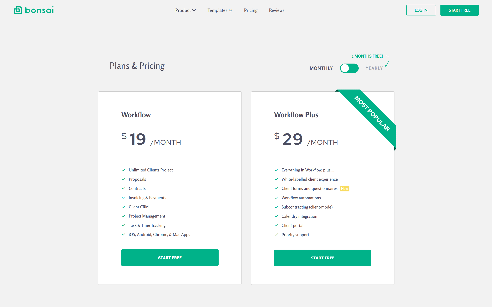

# Bonsai Landing Page 🌿

A modern and responsive landing page inspired by the [Bonsai freelance platform](https://www.hellobonsai.com/). This project showcases clean UI design, elegant typography, and sleek layout animations built with HTML and CSS.

## 🔗 Live Demo

Visit the site: [dani-sink.github.io/bonsai](https://dani-sink.github.io/bonsai/)

## 🛠️ Technologies Used

- **HTML5** – for semantic structure
- **CSS3** – for layout, responsiveness, and animations
- **Google Fonts** – for modern typography
- **Responsive Design** – using Flexbox and media queries

## 📐 Layout Features

- **Sticky Navigation Bar**
- **Pricing Section** for plan comparison
- **Add-ons Highlights** for options beyond the plans
- **CTA Section** with a simple and compelling message
- **FAQ Section** for common inquiries
- **Footer** with structured columns for quick links

## 💡 Inspiration

This page was built as a clone challenge from [Frontend Practice](https://www.frontendpractice.com/projects/bonsai) to practice modern UI layout and visual consistency.

## 📱 Responsiveness

The layout adapts seamlessly across screen sizes—from large desktops to mobile devices—ensuring a pleasant user experience on all platforms.

## 🚀 Getting Started

To run locally:

```bash
git clone https://github.com/dani-sink/bonsai.git
cd bonsai
open index.html
```

## 📸 Preview

  
_A snapshot of the p\Pricing section_

## 📄 Purpose

This project is for educational purposes and is not affiliated with Bonsai or any commercial use.

## 📄 License

This project is licensed under the [MIT License](https://opensource.org/licenses/MIT).  
You are free to use, modify, and distribute this project for educational and non-commercial purposes.
